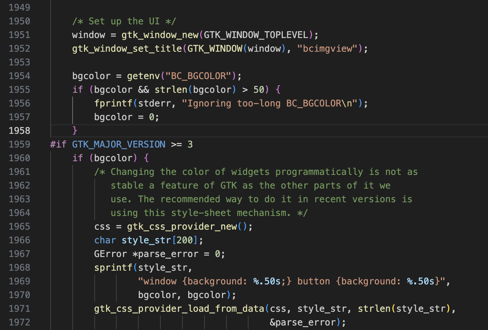

# BCIMGVIEW

  


## Table of Contents

- [About the Project](#about-the-project)
- [Attack I](#attack-i)
- [Attack II](#attack-ii)
- [Attack III](#attack-iii)
- [Attack IV](#attack-iv)
- [Attack V](#attack-v)
- [Tools Used](#tools-used)
- [Getting Started](#getting-started)
  - [Prerequisites](#prerequisites)
  - [Installation](#installation)
- [Usage](#usage)
- [Results and Evaluation](#results-and-evaluation)
- [Contributing](#contributing)
- [License](#license)
- [Contact](#contact)
- [Acknowledgments](#acknowledgments)

---

## About the Project

This project was created for teaching the class CSCI 4271W --- Designing and Developing Secure Software at UMN Twin Cities. I developed and taught from this project during Spring Semester 2024. 

- What is this project about?
- Why did you create it?
- What problems does it solve?
- Include a screenshot or demo (if applicable). Example:


---

## Attack I

## Attack II

## Attack III

## Attack IV --- Incorrect decompression logic in .bcflat encoded files leads to stack buffer overflow

This was by far the most subtle of all 4 attacks. Some might call it the most beautiful! Of roughly 70 students in this course, only 2 found and exploited this vulnerability perfectly. It is also notable because it was the only one of the 4 intentionally planted vulnerabilities which led to a buffer overflow on the stack. All the other buffer overflows were on the heap.

## Attack V --- CSS Injection

### Summary of the attack

This was not actually an attack in the most literal sense of the word. Cascading Style Sheets (CSS) is not a Turing complete language, so this vulnerability does not actually have the potential to cause things like arbitrary code execution or elevation of privilege.

In the wild however CSS injections can still be problematic. One such example could be an attacker using a CSS injection attack to display harmful advertisements on your website.

In our case the offending portion of the code is highlighted below. The vulnerability stems directly from a careless usage of environment variables on line 1954.

{:height="36px" width="36px"}

### Executing the Attack


---

## Tools Used

- **Frontend**: React, TypeScript
- **Backend**: Node.js, Express.js
- **Database**: MongoDB
- **Other Tools**: Docker, Webpack

---

## Getting Started

### Prerequisites

- Install [Node.js](https://nodejs.org/)
- Install [Git](https://git-scm.com/)
- (Optional) Install Docker if needed: [Docker Installation Guide](https://www.docker.com/)

### Installation

1. Clone the repository:

   ```bash
   git clone https://github.com/your-username/project-name.git
   cd project-name

## Usage

## Results and Evaluation

## Contact
